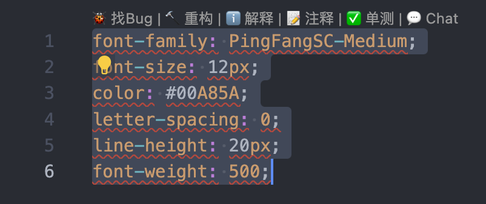
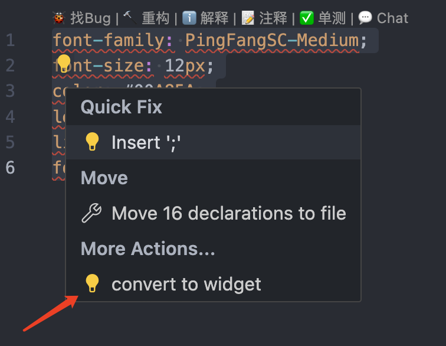
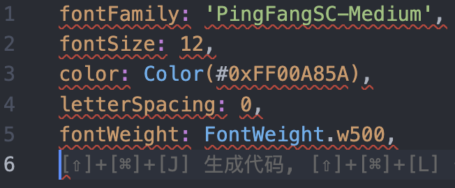

## Features

# css-to-widget

### 注意事项：

1. 圈选范围需要完整
2. css 样式需要格式化，至少要有';'分号

### 使用流程：

#### step1:

ctrl + shift + p `css-to-widget` 启动

#### step2: 圈选需要转换的样式（限定在 .dart 文件中）

#### step3: 点击 convert-to-widget

#### step4: 生成的结果放在合适的 widget 中

## Release Notes

## Known Issues
