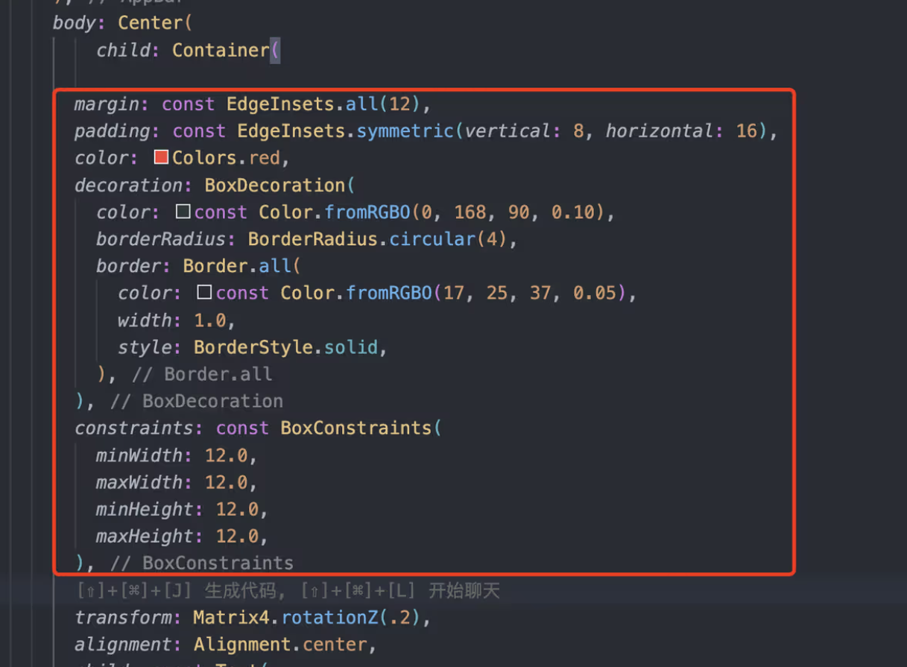

## Features

# css-to-widget

### 注意事项：

1. 圈选范围需要完整，css 要是选中的不完全这个插件也不知道具体该做啥是不
2. css 样式需要格式化，至少要有';'分号，比如 margin:12px;

### 使用流程：

#### step1:

ctrl + shift + p `css-to-widget` 启动

#### step2: 圈选需要转换的样式（限定在 .dart 文件中）

#### step3: 点击 convert-to-widget

#### step4: 生成的结果放在合适的 widget 中

### 自定义 css 样式-flutter 响应式的转换

添加自定义配置：src/common/widgetStyleMap.ts

- 比如我想把 font-family:xxx 转换成 fontFamily:xxx
- 或者我想把 margin:12px 转换成 margin:EdgeInsets.all(12)
  只需要在 map 中增加一段新的配置
  
- components: 具体的转换逻辑
  - setValue: 固定配置，复制粘贴现有的就可以
  - getValue: 修改 css 的值变成响应式格式的输出
- key: 生成的响应式格式的 key
- originKey: 原始 css 格式的 key
- valueFormat: css 格式的 value 需要怎么去处理，现在只有 pixel（删除 px）、 string（增加单引号），有需要可以自己加

## Release Notes

## Known Issues
